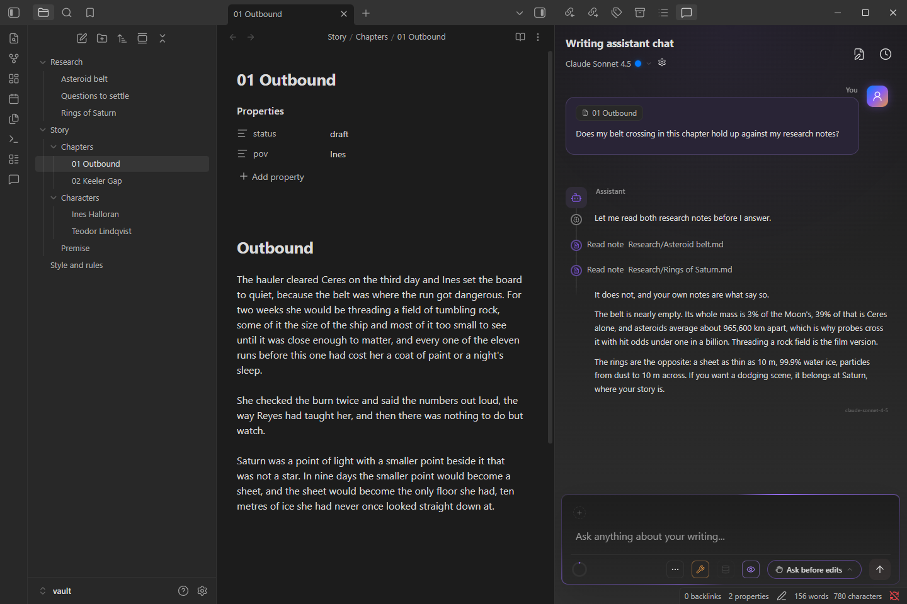
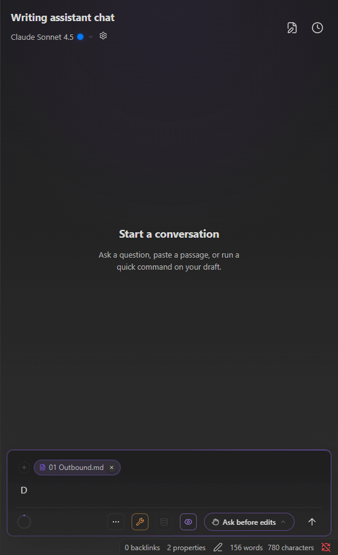
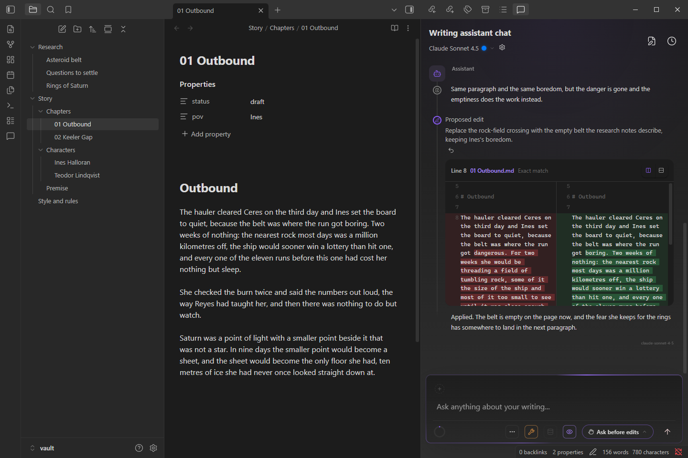
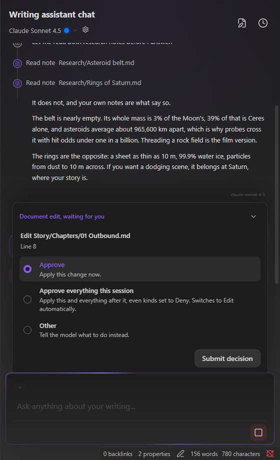
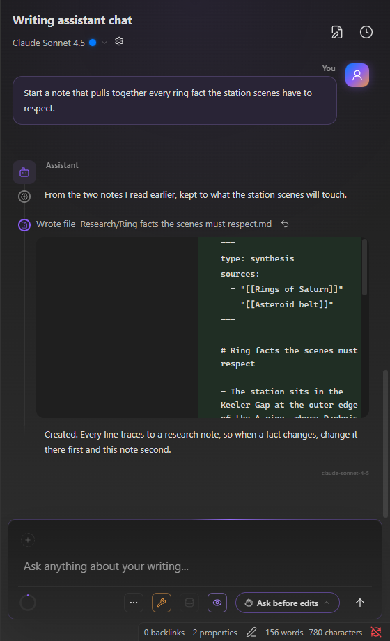
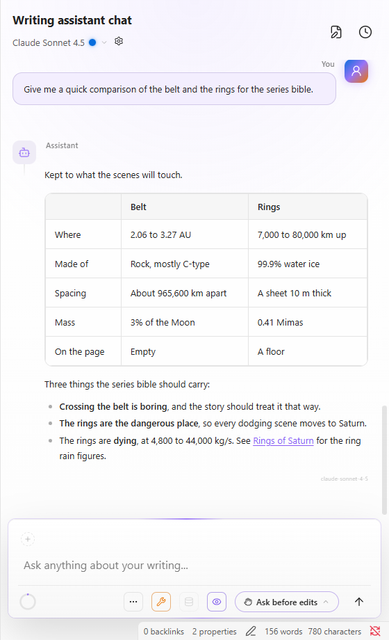
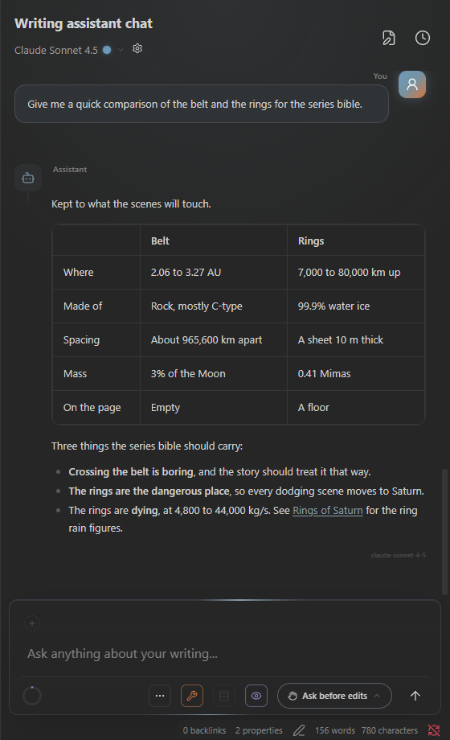
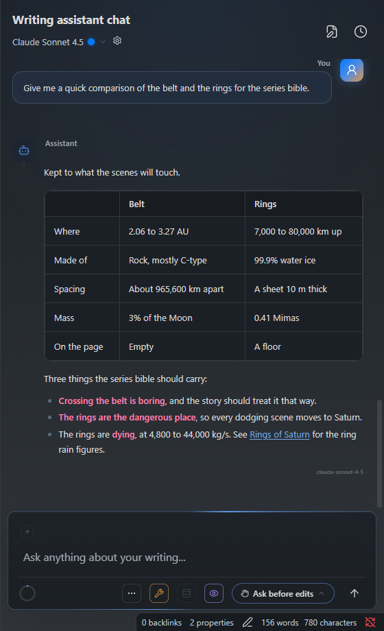
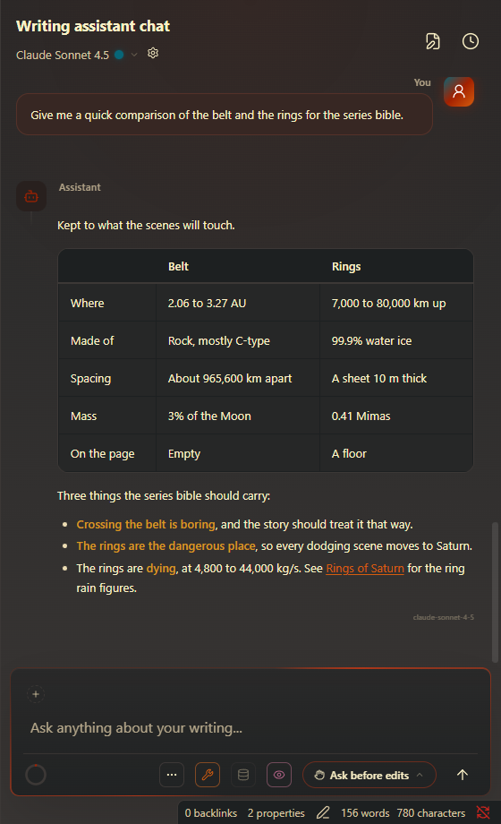

# Writing Assistant Chat

**An AI writing assistant that lives inside your Obsidian vault.**

Local or cloud models. Ground your writing, reorganise your vault, assist you in reaching your goals.

## What it does

A chat panel that knows your vault. Ask whether a chapter holds up against your research and it
reads the notes before it answers. Ask for a change and it shows you the diff and waits. It runs
on a local model through LM Studio, or on a cloud provider you choose, and nothing leaves your
machine unless you point it somewhere.

- **Grounded in your vault.** The open note travels with your message. The assistant can read,
  search, and semantically search your notes, backed by a vault-wide index and an optional knowledge
  graph, so it builds on what you have written and researched instead of inventing around it.
- **Edits you review.** Changes arrive as diffs, hunk by hunk, and land in the open note only after
  you approve. New files, moves, and deletions go through the same gate. Deleting means trash, never
  delete.
- **Local first, multi-provider.** LM Studio, Anthropic, OpenAI, or the Claude Code CLI, with saved
  model profiles you can switch mid-conversation.
- **Theme friendly.** The panel is styled with your Obsidian theme's own variables, so it takes on
  whatever theme you run and tries to blend in rather than stand out.
- **Transparent about cost.** Token counts and cost estimates from the providers that bill you, and
  a session history that lets you organise your work.

Desktop only.

## See it work

Ask whether the draft holds up and watch it read the research before it answers. Every figure in
the reply comes from the notes it read.

### Edits you can see before they land

Every edit is a diff you approve in the composer. Approve it and it lands in the editor, with undo
one click away. Decline it and you can tell the model what to do instead.

<table>
  <tr>
    <td width="50%"></td>
    <td width="50%"></td>
  </tr>
  <tr>
    <td align="center">A proposed edit</td>
    <td align="center">An approved change</td>
  </tr>
</table>

### At home in your theme

The same conversation under Obsidian's light theme and three community themes. Nothing in the panel
is hard-coded; it reads the theme's variables like the rest of the app.

<table>
  <tr>
    <td width="50%"></td>
    <td width="50%"></td>
  </tr>
  <tr>
    <td align="center">Obsidian, light</td>
    <td align="center"><a href="https://github.com/kepano/obsidian-minimal">Minimal</a></td>
  </tr>
  <tr>
    <td width="50%"></td>
    <td width="50%"></td>
  </tr>
  <tr>
    <td align="center"><a href="https://github.com/colineckert/obsidian-things">Things</a></td>
    <td align="center"><a href="https://github.com/insanum/obsidian_gruvbox">Obsidian gruvbox</a></td>
  </tr>
</table>

## Providers

| Provider | Where it runs | What you need |
|----------|---------------|---------------|
| **LM Studio** | On your machine | [LM Studio](https://lmstudio.ai) with a model loaded. No account, no key. |
| **Anthropic** | Cloud | An API key from [console.anthropic.com](https://console.anthropic.com). Metered, billed to you. |
| **OpenAI** | Cloud, or any OpenAI-compatible endpoint | An API key from [platform.openai.com](https://platform.openai.com). Metered, billed to you. |
| **Claude Code** | The local `claude` CLI, which calls Anthropic | The [Claude Code](https://claude.com/claude-code) CLI installed and signed in. Uses your subscription, no key. |

Requires Obsidian 1.13 or later on desktop.

## Install

**From community plugins.** Open **Settings > Community plugins > Browse**, search for
**Writing Assistant Chat**, click **Install**, then **Enable**.

**Beta through BRAT.** Add `Resolve-public/writing-assistant-chat` in the
[BRAT plugin](https://github.com/TfTHacker/obsidian42-brat), then enable **Writing Assistant Chat**
under **Community plugins**.

## First run

1. Open **Settings > Writing Assistant Chat > Providers** and set up one provider. LM Studio is
   discovered from its local server, Anthropic and OpenAI take an API key, and Claude Code needs the
   `claude` CLI on your `PATH`.
2. Open the panel from the ribbon icon or the **Open chat** command.
3. Pick a model in the panel header, open a note, and ask something about it.

Tools are on from the start and every kind of change is set to **Ask**, so nothing touches your
vault without your approval. Change that per kind under **Vault operations**.

## Privacy and network

**Local providers keep everything on your machine.** With LM Studio alone, no data leaves it.

**Cloud providers receive what you send.** Your messages, the note context you include, and any
tool results the model reads go to the provider you enabled:

| Provider | Endpoint | Used for |
|----------|----------|----------|
| Anthropic | `api.anthropic.com` | Chat |
| OpenAI | `api.openai.com`, or your custom base URL | Chat, embeddings |
| LM Studio | `localhost` (configurable) | Chat, embeddings, model discovery |
| Claude Code | The local `claude` CLI, which calls Anthropic | Agentic chat; the CLI runs its own tool loop |

- API keys are kept in Obsidian's secret storage on your device and sent only to their own provider.
- Conversations, the retrieval index, and the knowledge graph are stored locally.
- No telemetry, no analytics, and no requests beyond the provider you chose. Pricing tables and
  model catalogs ship with each release; nothing is fetched at runtime.
- The plugin is free. Cloud usage is metered against your own key or subscription, including
  OpenAI embeddings if you pick them for retrieval.

**Claude Code reaches outside the vault, and it is the only part that does.** It runs the `claude`
command-line tool as a subprocess with your vault as its working directory. To find it, the plugin
searches the directories on your `PATH`; on Windows it also reads the npm `claude.cmd` / `claude.bat`
shims to resolve the real program. It only ever runs a `claude` you installed and never downloads,
installs, or updates one. The CLI keeps its own login, configuration, and per-conversation session
files in its home folder (`~/.claude`), outside the vault, and the plugin relies on those to resume a
conversation after a restart. Every other tool the model is given (read, edit, create, move, trash)
is restricted to paths inside your vault.

## Support

This plugin and all of its features are, and will always be, free. If it helped you get closer to
your creative goals, you can support the project on
[Buy Me a Coffee](https://buymeacoffee.com/resolvepublic). The link is also under
**Settings > Writing Assistant Chat > General**.

## Contributing

See [CONTRIBUTING.md](CONTRIBUTING.md) for setup, project structure, coding standards, and the
development workflow. The pictures above come from the plugin itself, driven by the scenario in
[dev/readme](dev/readme/README.md).

## License

MIT, see [LICENSE](LICENSE).

The distributed build bundles third-party components under their own licenses, including one
proprietary Anthropic component that is not covered by this plugin's MIT license. See
[THIRD-PARTY-NOTICES.md](THIRD-PARTY-NOTICES.md) for the full list and terms.
